# Manual de Configuracion Practica 1
## Redes de Computadoras 1 

### Grupo 25:
* 201602855 - José Alejandro Grande Marín
* 201602909 - Edward Danilo Gomez Hernandez
* 201602999 - Alex Rene Lopez Rosa
* 201700918 - Cristian Alberto Suy Mejia

# Topologia 1
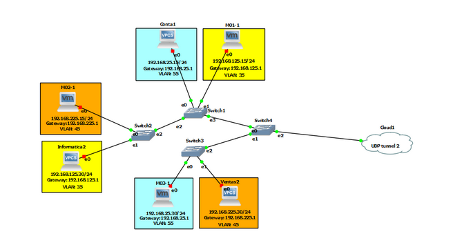

Esta primera topología consta 2 computadoras pertenecientes a cada departamento, de estos computadores uno es una VPCS y el otro una VM, al igual que una serie de switch en los cuales se configuran las VLANS a utilizar y el modo de trabajo de los distintos puertos, por último se cuenta con una nube la cual hace uso de una VPN para establecer conexión con la otra topología, la configuración de cada uno de estos dispositivos se explicará a más detalle a continuación.

## Configuracion de VM

### VM Informatica
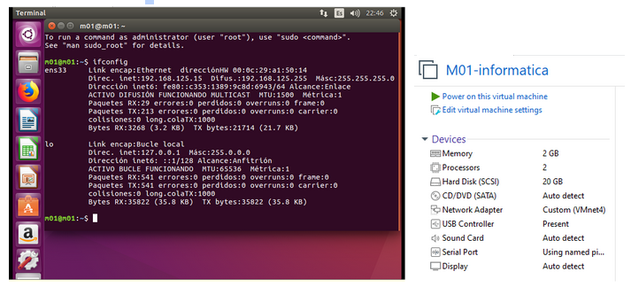

Esta VM corresponde a la utilizada en el Departamento de Informática fue configurada con los siguientes valores.
* Configuraciones:
    * IP:  192.168.125.15
    * Mascara de red: 255.255.255.0
    * Gateway:  192.168.125.1

### VM Contabilidad
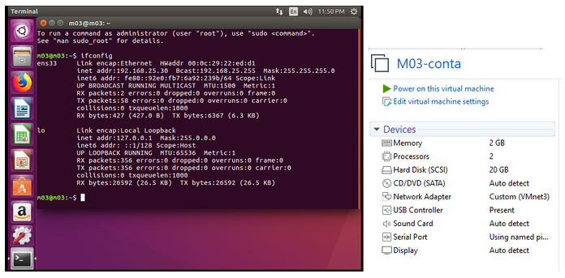

Esta VM corresponde a la utilizada en el Departamento de Contabilidad fue configurada con los siguientes valores.
* Configuraciones:
    * IP:  192.168.25.30    
    * Mascara de red: 255.255.255.0
    * Gateway:  192.168.25.1

### VM Ventas
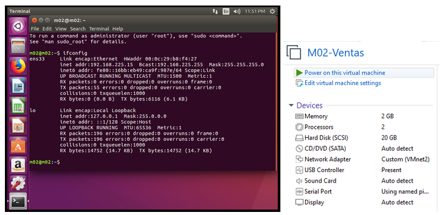

Esta VM corresponde a la utilizada en el Departamento de Ventas fue configurada con los siguientes valores.
* Configuraciones:
    * IP:  192.168.225.15
    * Mascara de red: 255.255.255.0
    * Gateway:  192.168.225.1

## Configuracion de VPCS 

### VPC Informatica
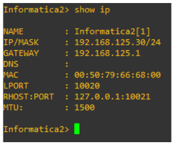

Esta VPCS corresponde a la utilizada en el Departamento de Informática fue configurada con los siguientes valores.
* Configuraciones:
    * IP:  192.168.125.30
    * Mascara de red: 255.255.255.0
    * Gateway:  192.168.125.1

### VPC Contabilidad
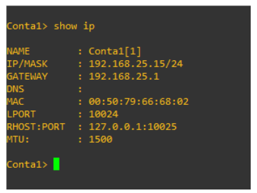

Esta VPCS corresponde a la utilizada en el Departamento de Contabilidad fue configurada con los siguientes valores.
* Configuraciones:
    * IP:  192.168.25.15    
    * Mascara de red: 255.255.255.0
    * Gateway:  192.168.25.1

### VPC Ventas
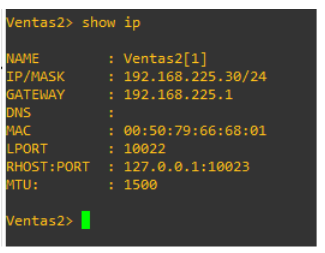

Esta VPCS corresponde a la utilizada en el Departamento de Ventas fue configurada con los siguientes valores.
* Configuraciones:
    * IP:  192.168.225.30    
    * Mascara de red: 255.255.255.0
    * Gateway:  192.168.225.1

## Configuracion de Switchs

### Switch 1
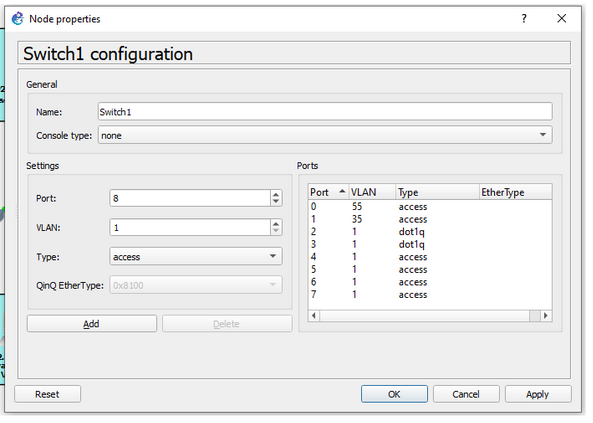

Para este switch se configuran los puertos 0,1,2,3 de la siguiente manera.
* Configuraciones:
    * Puerto 0: VLAN 55, modo access
    * Puerto 1: VLAN 35, modo access
    * Puerto 2: VLAN 1, modo trunk
    * Puerto 3: VLAN 1, modo trunk

### Switch 2
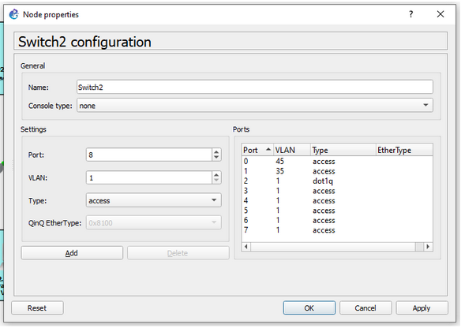

Para este switch se configuran los puertos 0,1,2 de la siguiente manera.
* Configuraciones:
    * Puerto 0: VLAN 45, modo access
    * Puerto 1: VLAN 35, modo access
    * Puerto 2: VLAN 1, modo trunk

### Switch 3
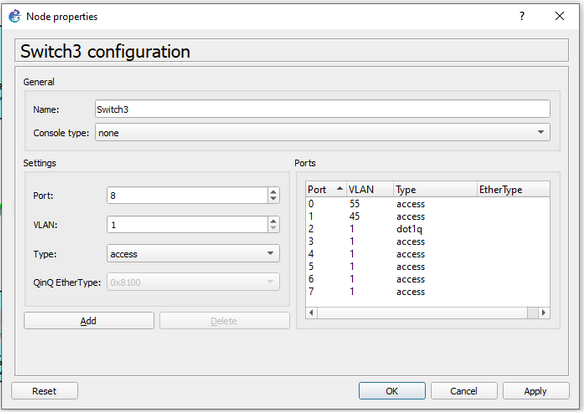

Para este switch se configuran los puertos 0,1,2 de la siguiente manera.
* Configuraciones:
    * Puerto 0: VLAN 55, modo access
    * Puerto 1: VLAN 45, modo access
    * Puerto 2: VLAN 1, modo trunk

### Switch 4
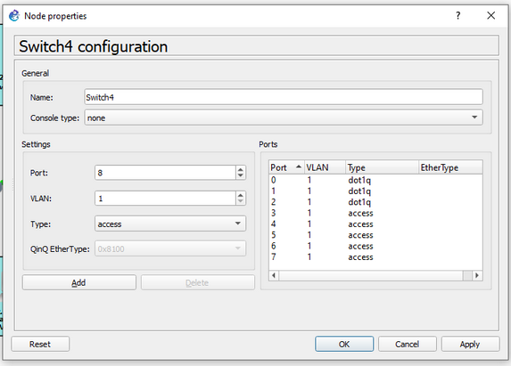

Para este switch se configuran los puertos 0,1,2 de la siguiente manera.
* Configuraciones:
    * Puerto 0: VLAN 1, modo trunk
    * Puerto 1: VLAN 1, modo trunk
    * Puerto 2: VLAN 1, modo trunk

## Configuracion Cloud 

### Cloud
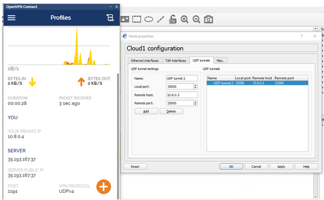

Para establecer la conexión con la otra topología se hace uso de OpenVPN, este se encuentra configurado en una VM en google cloud la cual cuenta con la siguiente IP 35.193.167.37.
La VPN en la máquina virtual asigna a la topologia 2 la siguiente IP 10.8.03, esta es configurada en la nube de la topología 1 para establecer la conexión con la otra topología.

# Topologia 2
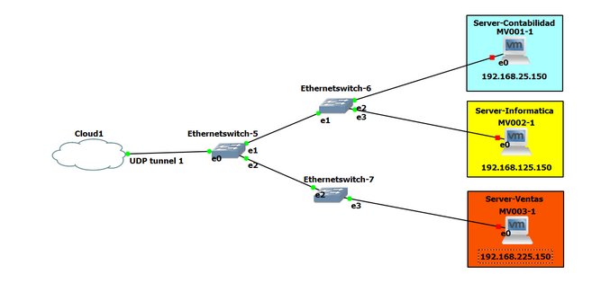

Esta es la segunda topología, consta de tres máquinas virtuales con sistema operativo Linux, para los cuales se configuró un servidor web, el cual tiene alojado un sitio web específico para cada departamento.  la configuración de cada uno de estos dispositivos se explicará a más detalle a continuación.

## Configuracion de VM

### VM Contabilidad
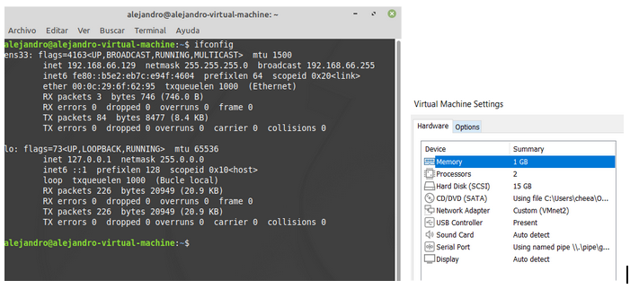

Esta VM corresponde a la utilizada en el Servidor del  Departamento de Contabilidad fue configurada con los siguientes valores.
* Configuraciones:
    * IP: 192.168.25.150
    * Mascara de red: 255.255.255.0
    * Gateway: 192.168.25.255

### VM Informatica
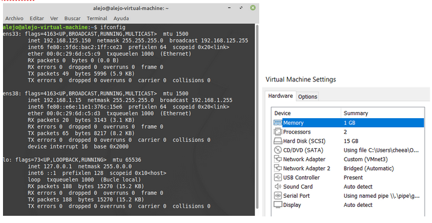

Esta VM corresponde a la utilizada en el Servidor del Departamento de Informática fue configurada con los siguientes valores.
* Configuraciones:
    * IP: 192.168.125.150
    * Mascara de red: 255.255.255.0
    * Gateway: 192.168.125.255

### VM Ventas
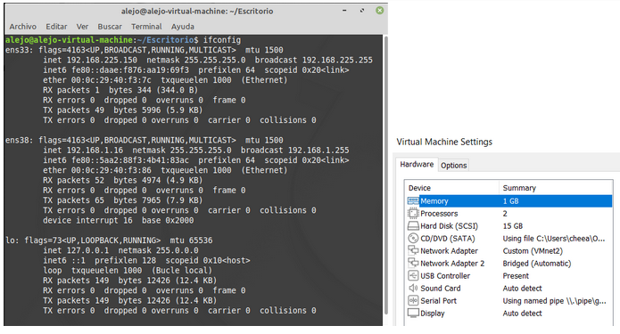

Esta VM corresponde a la utilizada en el Departamento de Ventas fue configurada con los siguientes valores.
* Configuraciones:
    * IP: 192.168.225.150
    * Mascara de red: 255.255.255.0
    * Gateway: 192.168.225.255

## Configuracion de Switchs

### Switch 5
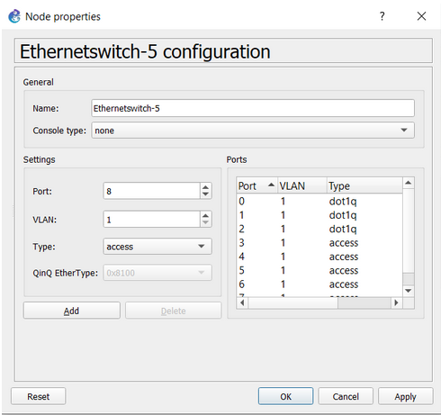

Para este switch se configuran los puertos 0,1,2 de la siguiente manera.
* Configuraciones:
    * Puerto 0: VLAN 1, modo trunk
    * Puerto 1: VLAN 1, modo trunk
    * Puerto 2: VLAN 1, modo trunk

### Switch 6
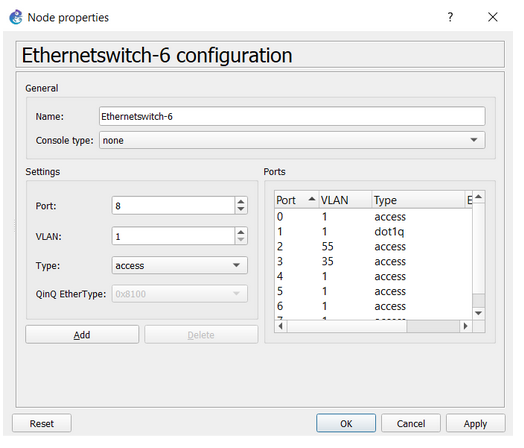

Para este switch se configuran los puertos 1,2,3 de la siguiente manera.
* Configuraciones:
    * Puerto 1: VLAN 1, modo trunk
    * Puerto 2: VLAN 55, modo access
    * Puerto 3: VLAN 35, modo access

### Switch 7
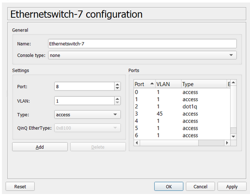

Para este switch se configuran los puertos 2,3 de la siguiente manera.
* Configuraciones:
    * Puerto 2: VLAN 1, modo trunk
    * Puerto 3: VLAN 45, modo access

## Configuracion Cloud

### Cloud
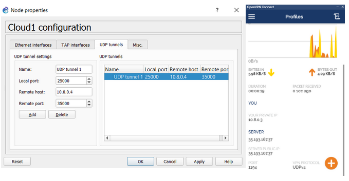

Para establecer la conexión con la otra topología se hace uso de OpenVPN, este se encuentra configurado en una VM en google cloud la cual cuenta con la siguiente IP 35.193.167.37.
La VPN en la máquina virtual asigna a la topologia 1 la siguiente IP 10.8.04, esta es configurada en la nube de la topología 2 para establecer la conexión con la otra topología.

# VM Google Cloud

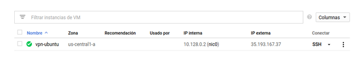

Es esta VM se encuentra alojada la VPN configurada con la cual es posible establecer la conexión entre las 2 topologías.

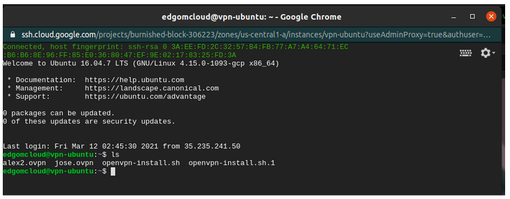

Los archivos alex2.ovpn, jose.ovpn cuentan con las configuraciones asignadas a las distintas computadoras que contienen cada topología.

# Servidores Web 

## Departamento Informatica
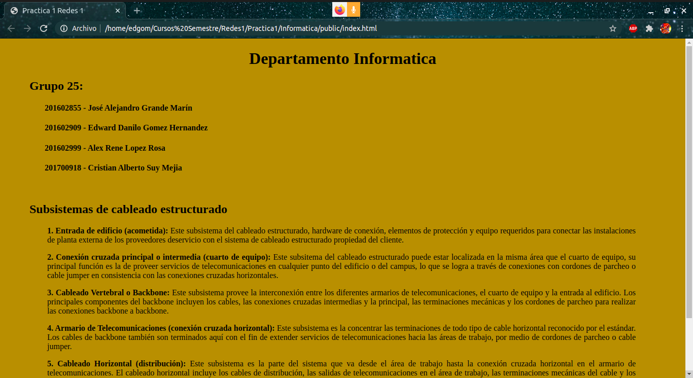

Este sitio web muestra los datos de los integrantes del grupo como tambien una pequeña investigacion de los subsistemas del cableado estructurado.

## Departamento Contabilidad
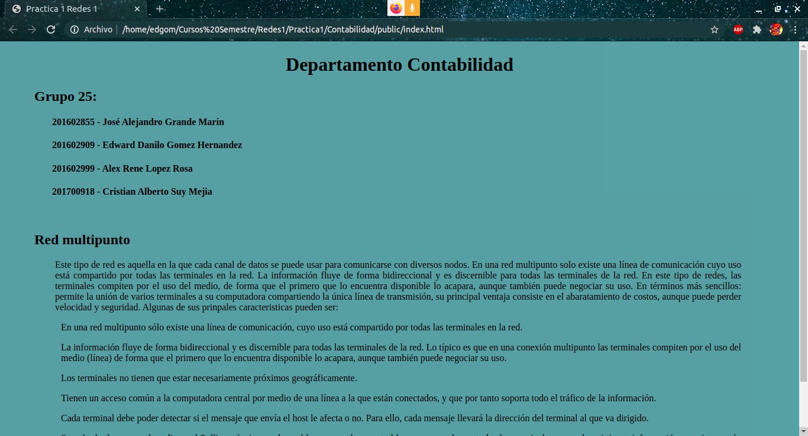

Este sitio web muestra los datos de los integrantes del grupo como tambien una pequeña investigacion de las redes multipunto.

## Departamento Ventas
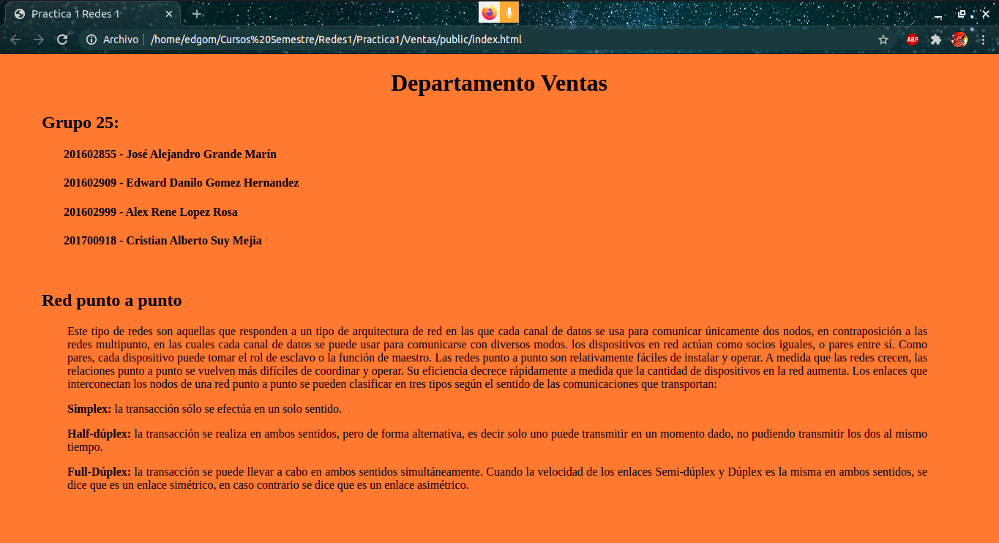

Este sitio web muestra los datos de los integrantes del grupo como tambien una pequeña investigacion de las redes punto a punto.